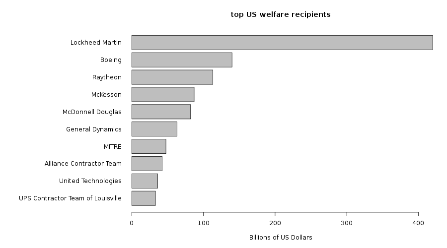

contracts
=========

Tools and data for exploring US Federal Government contracts

Latest
======

I've done more since this!

## 5/22/14

Plotted the "top 10 welfare recipients" of the United States. Not sure even 
what the time frame is for this, but a good start. Saved in `copy/figuresi/top_10_welfare.png`.



To create this I did:

```R
df <- read.csv('data/proc/company_totals.csv')

top10 <- head(df, 10) # already ordered
# to plot largest first, must reverse. We'll also convert to billions
top10 <- 
    data.frame( company=rev(top10$company), amt_bil=rev(top10$amount/1e9) )

png(filename="copy/figures/top_10_welfare.png", height=500, width=900)

par(las=1, mar=c(5,18,4,2))

barplot(top10$amt_bil, 
        main="top US welfare recipients", 
        horiz=TRUE, 
        names.arg=top10$company, 
        xlab="Billions of US Dollars")

dev.off() # close png connection
```

5/2/14
------

Here's the current setup. Me in the past made a file called
`data/proc/all_quoted.csv`. Sadly I don't exactly remember how. The original 
file is now `data/proc/all_quoted_desc.csv.bak` because I did the `sed` on it
that's found in a brand-new file, `bin/clean_all_quoted`. What this does is
more than clean, actually, maybe needs a name change. It does clean the data,
then pass the cleaned version along to a bunch of sed commands that clean 
and process. 

The final product of this is a csv file, currently I called it
`data/proc/dateAmtCompany.csv`, but you can make a new one like so:

```bash
bin/clean_all_quoted data/proc/all_quoted_desc.csv data/proc/dateAmtCompany.csv
```

Then you'll have a nice csv file with the date of a contract, the amount of the
contract, and the contractor:

```
date | amount | contractor
```

But they aren't called that.

Then I have written one R script to do a simple yet powerful operation:
aggregate the company totals. Do this like so:

```bash
Rscript R/aggCompanies.R data/proc/dateAmtCompany.csv \
    data/proc/company_totals.csv 
```

Now take this and make a pie, bar, or donut chart! mmm.... donuts....

Log
===
2/1/14
------
On re-running the processCleanDodCSV.d script, made with `make process_clean_csv`,
I found that it works fine and creates the data with the Unix date, contract
amount, and the contractor name. I originally chose using the Unix date because
Rickshaw.js used that. But since I'm rolling my own, that is unnecessary. The
immediate step then is to just output an ISO 8061 Date: "YYYY-MM-DD". Then 
using javascript the syntax for loading into D3 is (along with parsing the
contract amount, a double):

```js
parseDate = d3.time.format("%Y-%m-%d").parse;
data.forEach( 
    function(d,i){ 
            d.Date = parseDate(d.Date); 
            d.Amount = +Amount;
    }
);
```

12/20/13
--------
Success with histogram of top five companies 2001-2003. Next up, build a 
timeseries plot for each of these five. Color code using the color brewer as
developed in `workspace/rnd/vis_lixo`. The next touches will be pie chart to
compare those five to the rest of the total contracts for that period, plus
color-coding everything consistently between plots. Around the same time, start
making copy for this and preparing to merge in as the first blog post! It would
be great to also write a "how I did it" blog post.

*Technical progress:*
Need to parse the processed csv, `data/proc/*2001-2003.csv`, to be just the
top five. Look through manually to see variations on the top five names and
manually (i.e. via unique rules) normalize so, e.g., all variations on Lockheed
Martin (Lockheed-Martin, Lockheed Martin Fire Saftey, etc.) all map to 
Lockheed Martin. For starters, just get the timeseries with only exact matches
to the already-extracted names (as in `vis/data/p1_hist_data.csv`).


12/13/13
--------
Revisiting after a little break. Have some functions to get the 
month and date epoch, which will be useful for web viz. My plan for 
processing the 'raw' csv is to have a 'process CSV' function, which will
process the CSV by-line, but with successive improvements, like scraping out
the location, company name, contract code, and important bits of the 
description like 'missile defense', 'fire control', or 'small arms training.'
For processed data, scrap the full description. Keep it always in the raw files.
The raw CSV come from scraping defense.gov contract announcements.

For now, extract the epoch date and the company name. The functionality for
transforming a date like 'December 12, 2013' to an Unix-time epoch is written
with unittests. To extract the company name, split and take the first element
on `','`. 

But following agile/lean principles means getting one thing working first.
So, I also need to write the functionality to transform the raw file to just
epoch-coded date and amount. This is the first product. Second product is a 
processed file with the amount, the company name, and the date.

Then, I want to make a plot with Vincent that makes a stacked timeseries plot,
a stacked timeseries difference plot, and also an 'acceleration' plot. Compare
the acceleration of dollars spent to something mechanical and military, 
like the acceleration of an F-15, a Humvee, or something else.

Also it'd be interesting to do some relative variance analysis, or other stats
with R.

